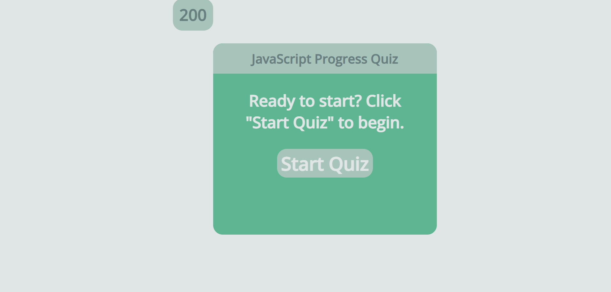

# js-progress-quiz

## Description

I built this quiz to determine my skill level as a web developer and also to test how well I was able to build the website using JavaScript, CSS, and HTML.

## Table of Contents (Optional)

- [Installation](#installation)
- [Usage](#usage)
- [Credits](#credits)
- [License](#license)

## Installation

No installation required. Simply open the website to

## Usage

The only user interaction on this webpage is through following the instruction buttons found on the page. The starting page can be found in this screenshot.

## Credits

The README template for this bootcamp was used here.

## License

The license is the MIT license found in the repository.